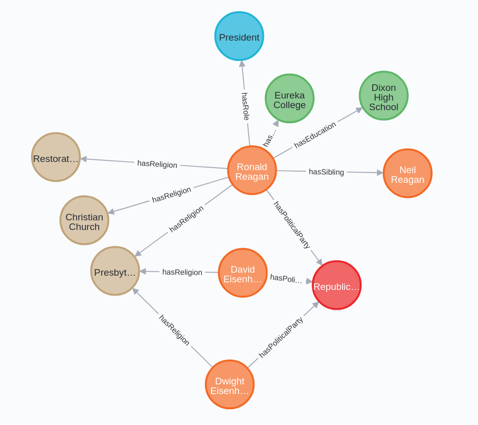

# Assignment 2: Text preprocessing

## Project description

This program downloads and preprocesses Amazon musical instrument review text for subsequent use in natural language processing analysis. By default, the program processes the `summary`column of the downloaded CSV, followed by tokenization, stemming, and lemmatization. Since stemming and lemmatization are used in lieu of one another, the program generates two outputs: one that has been stemmed and the other which has been lemmatized.

## Data organization

Inputs are downloaded into the `raw` data directory. The program saves outputs in the `processed` directory. This program is idempotent: the inputs are never overwritten; only new outputs are created.

.
├── work
│   ├── data
│   │   ├── BikeShot1_bgr.png
│   │   ├── BikeShot1_gray.png
│   │   ├── BikeShot1_normed.png
│   │   ├── BikeShot1_resized.png
│   │   ├── BikeShot1_rgb.png
│   │   ├── BikeShot2_bgr.png
│   │   ├── BikeShot2_gray.png
│   │   ├── BikeShot2_normed.png
│   │   ├── BikeShot2_resized.png
│   │   ├── BikeShot2_rgb.png
│   │   ├── BikeShot3_bgr.png
│   │   ├── BikeShot3_gray.png
│   │   ├── BikeShot3_normed.png
│   │   ├── BikeShot3_resized.png
│   │   ├── BikeShot3_rgb.png
│   │   ├── BikeShot4.jpq_bgr.png
│   │   ├── BikeShot4.jpq_gray.png
│   │   ├── BikeShot4.jpq_normed.png
│   │   ├── BikeShot4.jpq_resized.png
│   │   └── BikeShot4.jpq_rgb.png
│   └── raw
│       ├── BikeShot1.jpg
│       ├── BikeShot2.jpg
│       ├── BikeShot3.jpg
│       └── BikeShot4.jpq.png
├── Assignment4
│   ├── processed
│   └── raw
│       ├── Musical_Instruments_5.json
│       └── Musical_instruments_reviews.csv
└── readme.md

## Second Welcome
### Third Welcome

*italic*

**bold**

* list 1
* list 2

- list 1
- list 2

This decribes this particular project and directory level.

[GitHub Readme1 Reference](https://github.com/tchapi/markdown-cheatsheet/blob/master/README.md)

[General Readme2 Reference](https://www.mygreatlearning.com/blog/readme-file/#:~:text=When%20you%20create%20a%20repository,be%20easily%20converted%20to%20text)

Bring in local graphic
 

Bring in remote graphic
 
