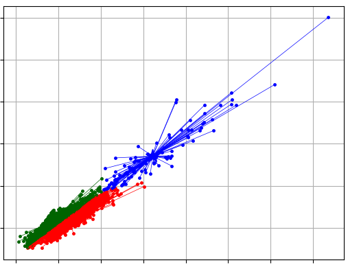
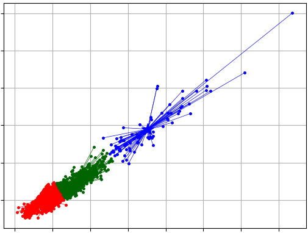

# Final Project: Landcover Change Detection

## Project description

This program runs an end-to-end data pipeline to detect landcover changes using Sentinel-2 satellite imagery using an online algorithm. The pipeline consists of the following steps:
* Download satellite imagery for user-selected regions; use Dask to more quickly download [cloud optimized GeoTIFFs](https://www.cogeo.org/) (COGs) from the [STAC](https://stacspec.org/) catalog.
* Train a multilayer perceptron (MLP) autoencoder to reduce 8-band scenes to two to speed up downstream processes.
* Train a [KMeans classifier](https://github.com/annoviko/pyclustering) using [Mahalanobis distance](https://en.wikipedia.org/wiki/Mahalanobis_distance) to label the 2-channel encoded scenes to simplify the change detection task.
* Change detection: Applies an implementation of [Bayesian online changepoint detection](https://arxiv.org/pdf/0710.3742.pdf) (BOCPD) to identify discontinuities in the KMeans-labeled scenes.
* Summarize change detection outputs into rasters for subsequent analysis.

## Six D's of design
* Decomposition: This project implements an online landcover change detection algorithm that can be deployed at scale. The online aspect of this allows users to not have to retrain their model(s) on all the data; only the next datapoint is needed. Furthermore, landcover change detection is an active field of research; this approach aimed to contribute to that field by using KMeans as a way to simplify the task of the change detection algorithm.
* Domain expertise: The design of the system is informed by the author's experience working with geospatial data. STAC, [Open Datacube](https://www.opendatacube.org/overview#:~:text=The%20Open%20Data%20Cube%20%28ODC%29%20is%20an%20open,organization%20and%20analysis%20of%20large%20gridded%20data%20collections.), [Dask](https://www.dask.org/) were used because they allow for the distributed download of the data. Parallelization was employed multiple times to speed up execution.
* Data: The most difficult and time-consuming part of this project was the data download and preprocessing. Satellite imagery - even with STAC, Open Datacube, and Dask - remains challenging.
* Design: The original goal of this project was to train an MLP at the pixel level and to use its error as a change signal. This effort failed to provide good results, and so the approach was adapted to create pixel-level signal that a simple change detection algorithm could handle. Specifically, an MLP reduced bands to just two and then that output was further transformed using KMeans labels to yield a one dimensional dataset of four labels. 
* Diagnosis: To train the MLP, train, test, and validation sets were created. Tuning was performed across multiple parameter combinations to find the model that performed best on the validation / test data.
* Deployment: The online nature of this project allows for continuous monitoring and the modular construction of it allows for the user to swap out change detection and preprocessing steps.

## Dimensionality reduction

After experiments with running the change detection algorithm indicated runtime was too long, approaches to dimensionality reduction were explored. [Principal components analysis](https://en.wikipedia.org/wiki/Principal_component_analysis) (PCA) was considered but this approach does not preserve the non-linear relationships among the features. Instead, a multilayer perceptron (MLP) autoencoder was trained using PyTorch to reduce the feature count to two to 1) improve runtime and 2) increase interpretability. Only the encoder layer of the MLP was retained; the reconstructed output was not needed. A GPU was used to speed up MLP training. Instructions for creating a Docker training with GPU enabled is provided later in this README.

## Clustering approach

The dimensionality reduction step reduced the number of features to two, making the change detection approach computationally feasible on the author's machine. However, the change detection algorithm struggled with the noisiness of the signal data, even after median smoothing was applied to each pixel's time series. To simplify the data for the change detection algorithm, KMeans clustering was applied to reduce the two MLP components / channels to one dimension of integer labels. However, the default Euclidean distance used by the standard KMeans algorithm did not capture the observed covariances of the clusters. The Mahalanobis distance, which takes covariance into its distance function, was used and ultimately provided better change detection results. 

The Mahalanobis distance plot across all six regions is shown below. Rather than yielding cloud / blob-like clusters like Euclidean distance, the Mahalanobis distance finds clusters that better fit the distribution of this dataset.



For comparison, a plot of the same number of clusters using Euclidean distance is provided blow.



To speed up KMeans, the library the author used implemented much of the training code in parallelized C. The author also parallelized the labeling of the pixels.

An example of the types of maps produced by the KMeans outputs is provided below of a region in Afghanistan.


## Change detection approach

An [implementation](https://github.com/gwgundersen/bocd) of the Bayesian online changepoint detection algorithm (BOCD) was used to detect changes. In this approach, one model is fit for every pixel. For the six datasets considered, this amounts to millions of pixels. Hence, parallelization of the CPU was implemented to speed up the change detection process. An example of change detection outputs for a change pixel are provided below. In the figure, the author, after visually inspecting the pixel and landcover imagery, picked the "true" changepoints (red dashed lines). The BOCD model suggested one pixel (purple dashed lines) in between the author's estimates. In the figure, the top figure provides cluster labels, which show how the pixel bounces between classes over time. The bottom figure shows run length. Each time step has its own model which looks back in time. The more likely models can be recovered by taking the `arg max` of the two-dimensional matrix of run lengths, where each axis is time. The model predicted the change where the most probable model's probability dropped to near zero.


For comparison, below is an example of a plot of a non-change detection pixel, as classified by the author. The BOCD algorithm correctly predicts no changepoints.


## Project structure

The project structure is provided below for reference:
```
│   .env
│   1-Download.ipynb
│   2-Train.ipynb
│   3-Infer.ipynb
│   4-Cluster.ipynb
│   5-Detect.ipynb
│   6-Annotate.ipynb
│   bocpd.py
│   clustering.py
│   detect.py
│   Dockerfile
│   download.py
│   readme.md
│   requirements.txt
│   task.py
│   utils.py
│   __init__.py
│
├───figs
│       Change detection plot.png
│       Change pixel.png
│       Euclidean-distance-clusters.png
│       Mahalanobis-distance-clusters.png
│       Manhattan-distance-clusters.png
│       Non-change pixel BOCPD.png
│       Zoomed-in-scatter.png
│
├───mlp
│       datasets.py
│       mlp.py
│       train.py
│       __init__.py
│
└───regions
        af-kharkamar-2022.geojson
        gm-kanifing-2022.geojson
        in-cianjur-2022.geojson
        mg-farafangana-2022.geojson
        tr-islahiye-2023.geojson
        us-baltimore-9999.geojson
```

### Notebooks

There are five notebooks, each numbered in order of execution, that allow the user to interactively explore the program. Each notebook maps to a step in the `task.py` module.

### `.env` file

A `.env` file is required to run the program. An example of one is below. All of the API keys are free to obtain.

```
USGS_API_KEY=your-key
USGS_TOKEN_NAME=your-token
USGS_USERNAME=your-usernam
USGS_PASSWORD=your-password
AWS_ACCESS_KEY=your-aws-access-key
AWS_SECRET_KEY=your-aws-secret-key
NASA_EARTHDATA_S3_ACCESS_KEY=your-nasa-access-key
NASA_EARTHDATA_S3_SECRET_KEY=your-nasa-earthdata-s3-key
NASA_EARTHDATA_S3_SESSION=your-nasa-session-key
NASA_EARTHDATA_USERNAME=your-nasa-earthdata-username
NASA_EARTHDATA_PASSWORD=your-nasa-earthdata-password
PLANETARY_COMPUTER_API_KEY=your-planetary-computer-api-key
PLANETARY_COMPUTER_SERVER=your-planetary-computer-server
```

## Project execution

The project is driven by the `task.py` module, which executes each task. The user may skip any of the tasks in `task.py` using command line arguments.

The user has the following options at the command line.
```
options:
  -h, --help            show this help message and exit
  --data_dir DATA_DIR   Path to data directory.
  --cores CORES         Number of cores to use.
  --skip_download       True to skip downloading COGs.
  --stac_endpoint STAC_ENDPOINT
                        STAC enpoint URL.
  --collections COLLECTIONS [COLLECTIONS ...]
                        List of STAC collections to download from.
  --output_bands OUTPUT_BANDS [OUTPUT_BANDS ...]
                        List of bands to retain.
  --skip_train_mlp      True to skip training of MLP.
  --tr_val_split TR_VAL_SPLIT
                        Fraction of training v. validation set.
  --batch_size BATCH_SIZE [BATCH_SIZE ...]
                        MLP batch size.
  --epochs EPOCHS       MLP epochs.
  --gamma GAMMA         MLP gamma.
  --skip_mlp_inference  True to skip MLP inference.
  --skip_clustering     True to skip KMeans task.
  --skip_change_detection     True to skip change detection task.
```

## Docker: Local runs

Rather than clone the repository to run the code, the user can opt to pull Docker image for this assignment
from [the DockerHub repo](https://hub.docker.com/repository/docker/pgrjhu/705.603/general).

Pull the image: `$ docker pull pgrjhu/705.603:final`

Instantiate the container:

```
docker run \
-p 8888:8888 \
-dit \
--name final \
pgrjhu/705.603:final
```

Enter the container:
```
docker exec -ti final bash
```
### Running notebooks
In the container, to run the notebooks, you'll need to start Jupyter notebook:
```
jupyter notebook --ip=0.0.0.0 --port=8888 --no-browser --allow-root
```

Then open up `localhost:8888` in your browser, enter the key from the terminal, and open the desired notebook.

### Running `.py` file

In `/work`, execute `python task.py` to reproduce the local results.

## Docker: Local runs

To build the container and have Jupyter notebook with GPU (recommended for MLP training):
```
docker run \
    --gpus all \
    --restart=unless-stopped \
    -it \
    -p 8888:8888 -p 8787:8787 -p 8786:8786 -p 5000:5000 \
    [image_id]
```

## Jupyter

To start a Jupyter Lab session, do:
`$ jupyter lab --no-browser --ip=0.0.0.0 --allow-root`
